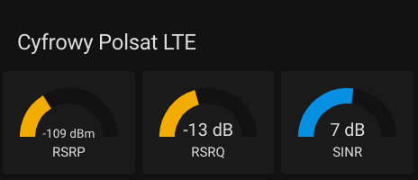

# Home Assistant - Cyfrowy Polsat (Polsat Box) - LTE signal parameters integration

Supported devices:
* LTE ODU/IDU-200 (should also work with IDU-100) (http://www.polsatbox.pl/oferta/internet/zestaw-domowego-internetu-2.cp)

Before pasting my configuration to your one, please remember to replace placeholders with your router specific ones:
* ```<ROUTER_IP>```
* ```<ROUTER_LOGIN>```
* ```<ROUTER_PASSWORD>```

Configuration provides couple sensors:
* CP LTE data prepare - this is a dummy sensor running command to authenticate and scrap HTML page with the data from thh router admin interface
* the rest provide access to common LTE signal indicators:
     * [SINR](https://en.wikipedia.org/wiki/Signal-to-interference-plus-noise_ratio)
     * [RSRQ](https://wiki.teltonika-networks.com/view/RSRP_and_RSRQ)
     * [RSRP](https://wiki.teltonika-networks.com/view/RSRP_and_RSRQ)

After adding sensors to configuration example widget may be added to your instance UI:

